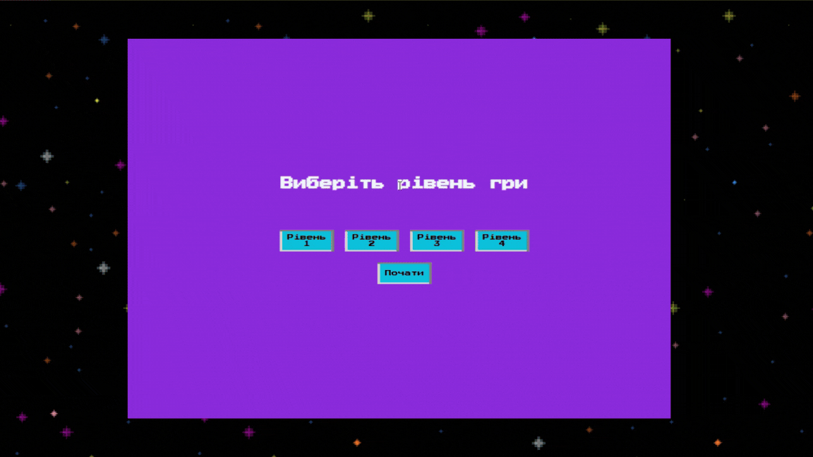
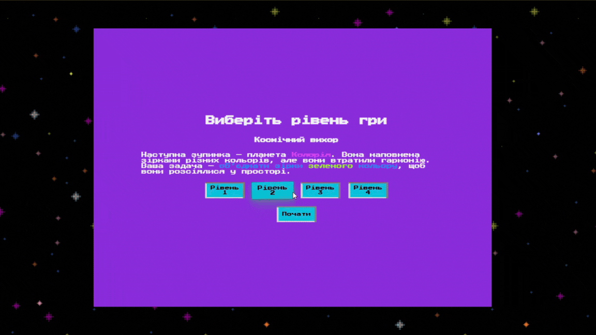
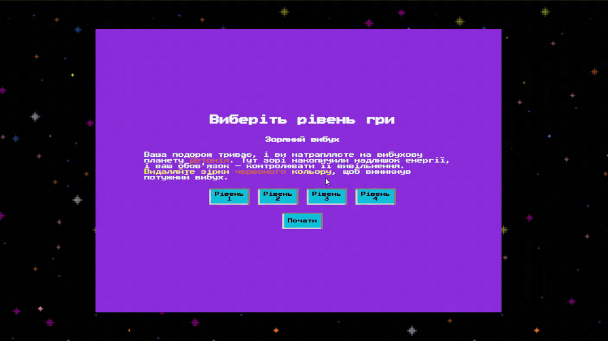
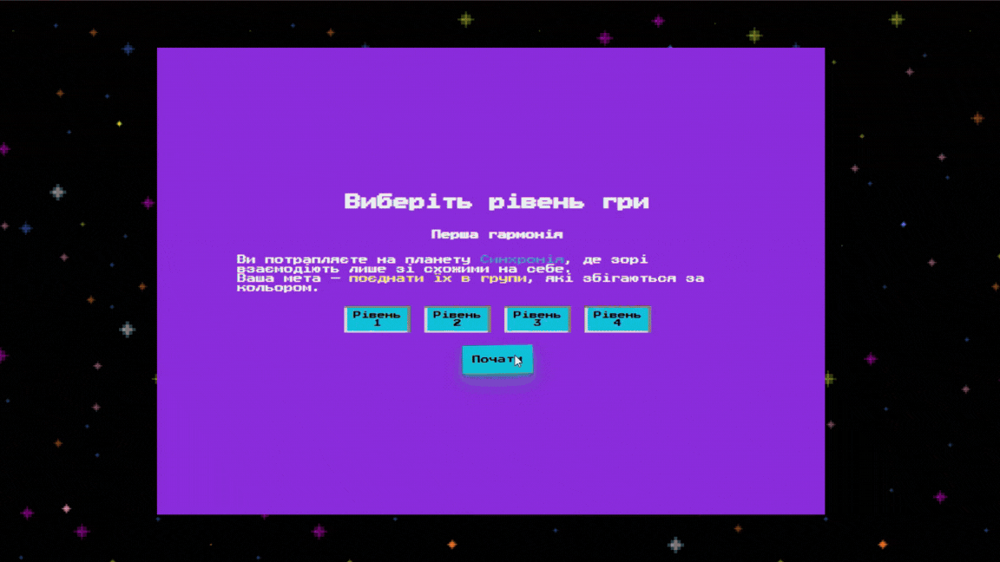
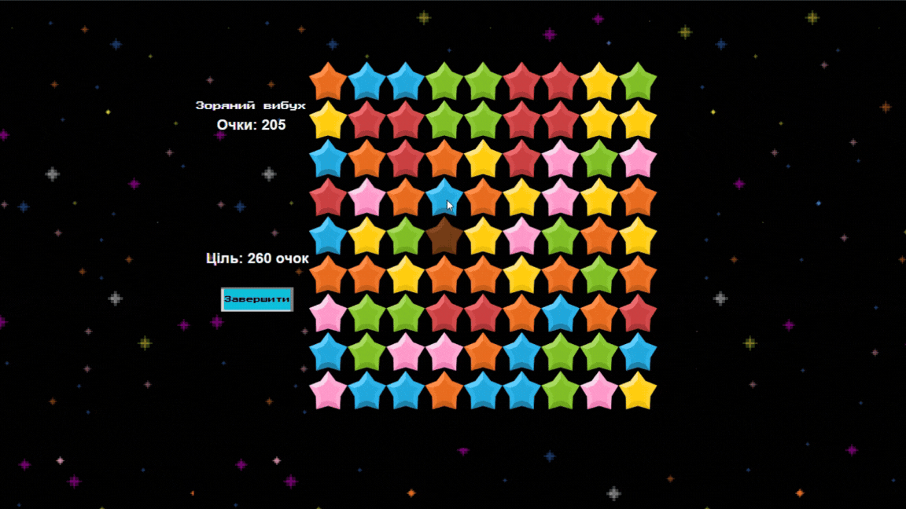

# 🌟 **Зоряний Шлях**

_Подорожуй галактикою, вирішуй головоломки використовуючи різні комюінації зірок!_

---

## 🪐 **Опис гри**

"Зоряний Шлях" — це гра в жанрі "три в ряд", де гравець має пересувати елементи на ігровому полі, щоб скласти ряди з трьох або більше однакових елементів.

Кожен рівень має свою особливість та випробування! 🚀


---

## 🎮 **Як грати**

1. Перетягуйте зірочки, щоб створити комбінації з 3 або більше однакових елементів.
2. На кожному рівні є свої особливості для комбінаціїї зірок.
3. Використовуйте бонуси для легшого проходження!

### 🌟 **Механіки рівнів:**

- **1 рівень "Зоряний хрест"**: Обираючи комбінацію з помаранчевих зірок, відбувається видалення "хрестиком", тобто всіх елементів по горизонталі та вертикалі.
- **2 рівень "Гармонія кольорів"**: Обираючи комбінацію з зелених зірок, відбувається видалення всіх зірок одного кольору.
- **3 рівень "Зоряний вибух"**: Обираючи комбінацію з червоних зірок, відбувається вибух на полі у радіусі 2x2.
- **4 рівень "Перша гармонія"**: Видалення зірок схожих за кольором.

---

## 📸 **Скріншоти гри**

## Меню гри:


## 1️⃣ 1 рівень Зоряний хрест:

Ви потрапляєте на планету Хресторія, де зорі хаотично переплелися. Вам потрібно виправити їх положення, видаляючи блакитні зірки хрестиком. Збирайте комбінації, щоб очистити зоряне небо.


## 2️⃣ 2 рівень Космічний вихор:

Наступна зупинка — планета Колорія. Вона наповнена зірками різних кольорів, але вони втратили гармонію. Ваша задача — об’єднати зірки зеленого кольору, щоб вони розсіялися у просторі.



## 3️⃣ 3 рівень Зоряний вибух:

Ваша подорож триває, і ви натрапляєте на вибухову планету Детонія. Тут зорі накопичили надлишок енергії, і ваш обов'язок — контролювати її вивільнення. Видаляйте зірки червоного кольору, щоб виникнув потужний вибух.


## 4️⃣ 4 рівень Перша гармонія:

Ви потрапляєте на планету Синхронія, де зорі взаємодіють лише зі схожими на себе. Ваша мета — поєднати їх в групи, які збігаються за кольором.


## Завершення гри:

Для успішного завершення рівня потрібно набрати певну кількість очок, яка залежить від обраного рівня.


---

## 💻 **Встановлення та запуск**

### 1.

```bash
git clone https://github.com/ukioxz/match3_js.git
npm run dev
```
