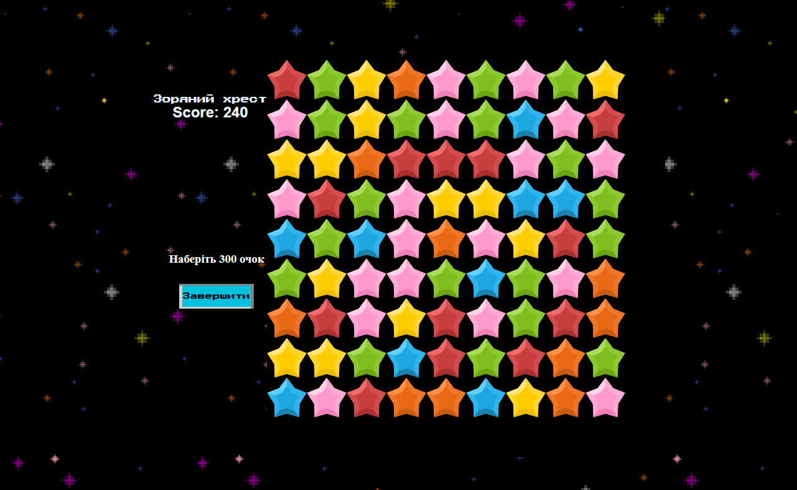
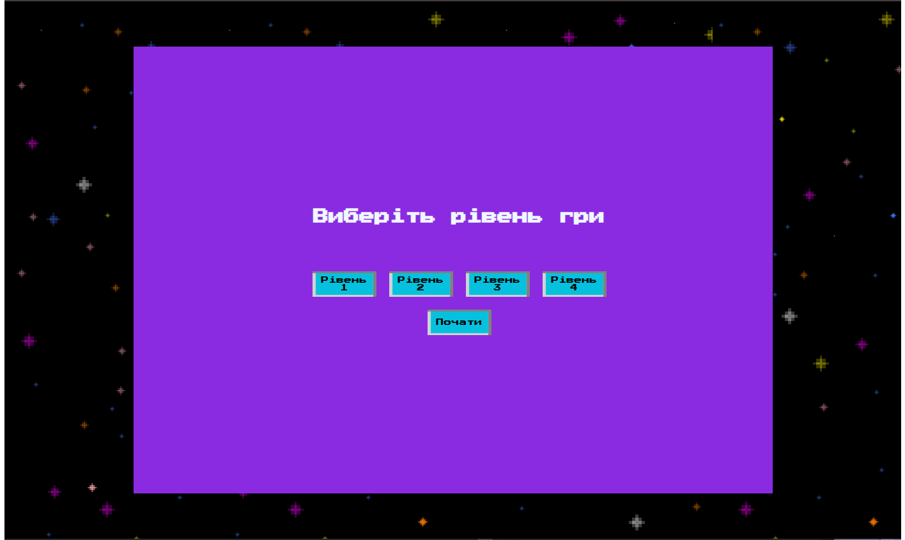
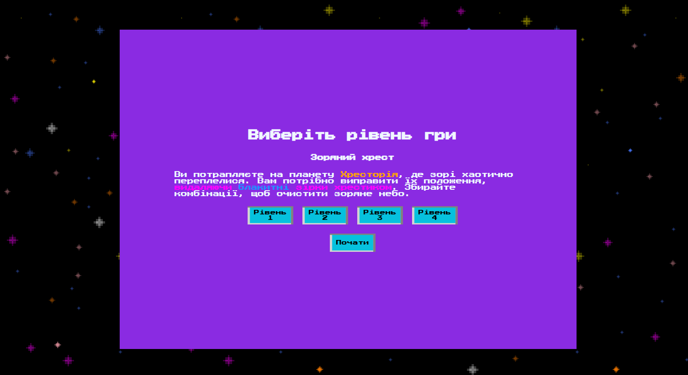
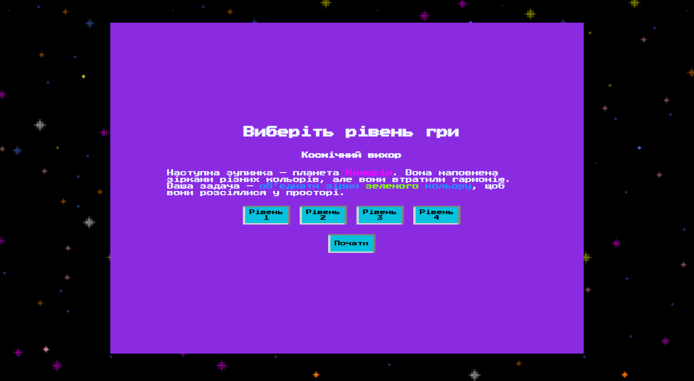
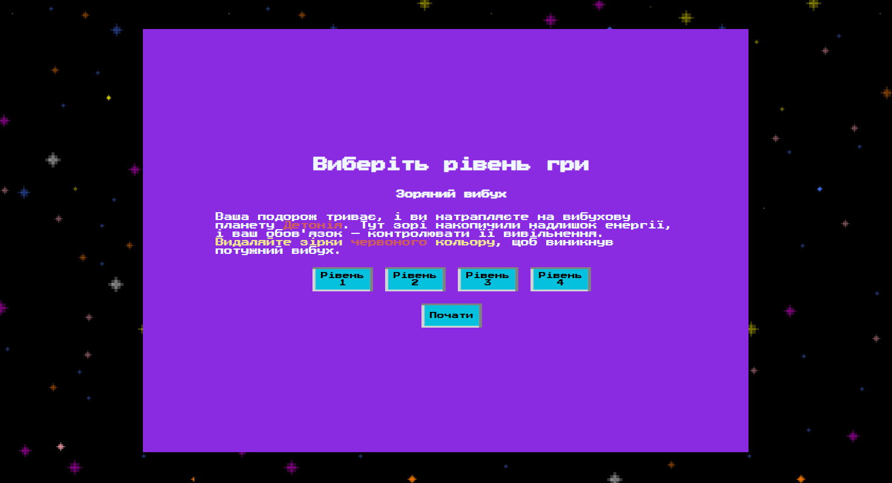
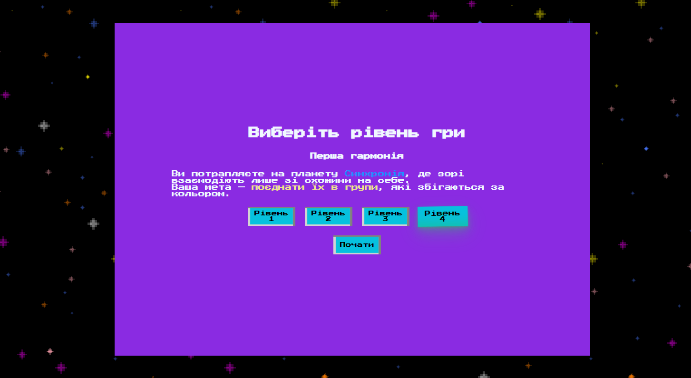
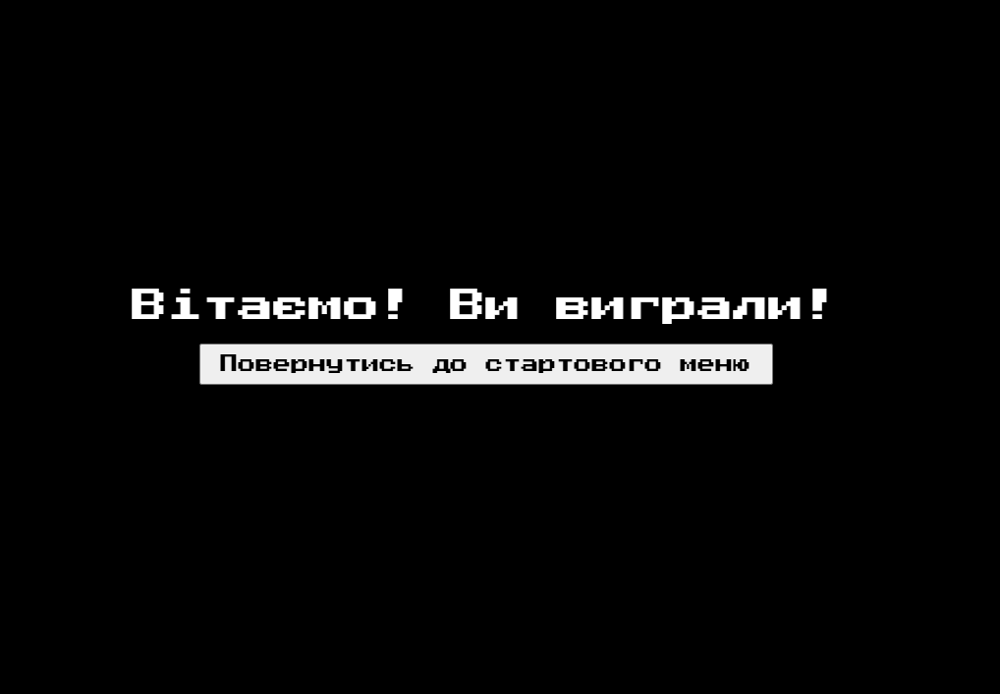

# 🌟 **Зоряний Шлях**

_Подорожуй галактикою, вирішуй головоломки та відновлюй гармонію між зорями!_

---

## 🪐 **Опис гри**

"Зоряний Шлях" — це гра в жанрі "три в ряд", де вам доведеться:

- Збирати різнокольорові зірочки.
- Виконувати унікальні місії на кожному рівні.
- Подорожувати загадковими планетами.

Кожен рівень має свою особливість та випробування! 🚀



---

## 🎮 **Як грати**

1. Перетягуйте зірочки, щоб створити комбінації з 3 або більше однакових.
2. Виконуйте завдання рівня, щоб перейти до наступної планети.
3. Використовуйте бонуси для легшого проходження!

### 🌟 **Механіки рівнів:**

- **1 рівень "Зоряний хрест"**: Видалення всіх елементів по горизонталі та вертикалі.
- **2 рівень "Гармонія кольорів"**: Видалення всіх зірок одного кольору.
- **3 рівень "Зоряний вибух"**: Вибух у радіусі 2x2.

---

## 📸 **Скріншоти гри**

**Меню гри:**  


1️⃣ **1 рівень Зоряний хрест:**  


2️⃣ **2 рівень Космічний вихор:**  


3️⃣ **3 рівень Зоряний вибух:**  


4️⃣ **4 рівень Перша гармонія:**  


**Завершення гри:**  


---

## 💻 **Встановлення та запуск**

### 1.

```bash
git clone https://github.com/username/star-path.git
npm run dev
```
